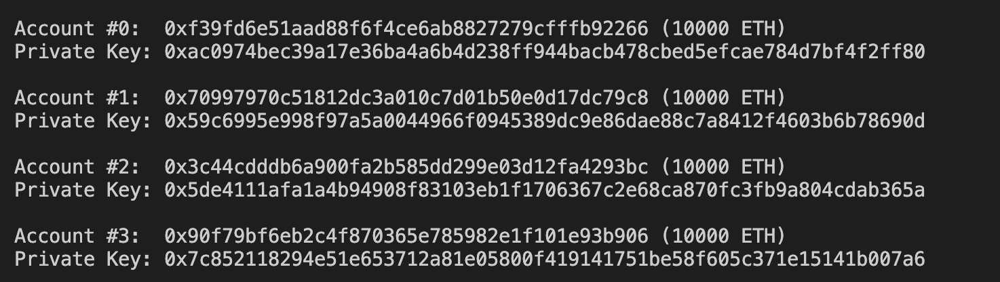
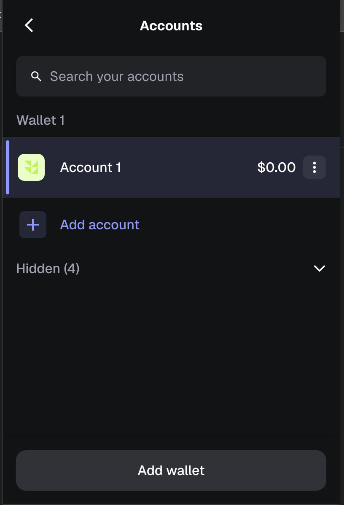
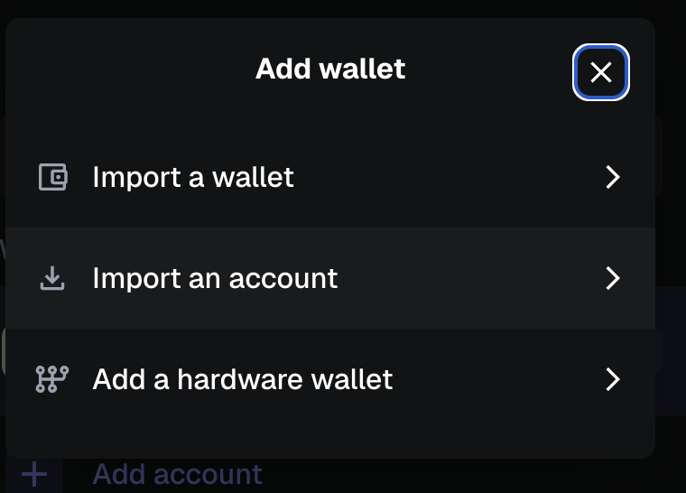
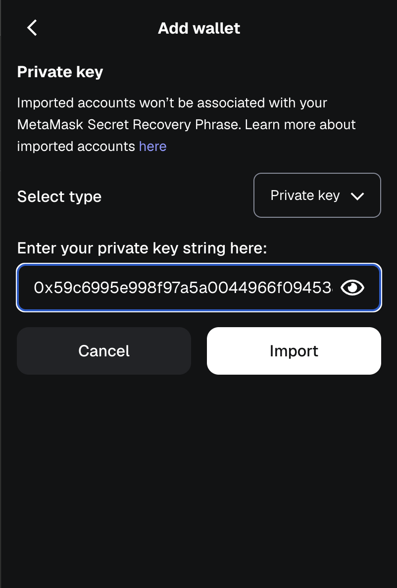

<h1>Commands</h1>

## Lokale Node starten (1. Terminal)

`npx hardhat node`

## Deployment auf lokale Node (2. Terminal)

`npx hardhat ignition deploy Counter.ts --network localhost`

## Interaktionen

### Konsole starten:

`npx hardhat console --network localhost`

### Contract aufrufen:

<i style='opacity:0.6'>

(Counter-Contract)

```
const { viem } = await network.connect();
const counter = await viem.getContractAt(
"Counter",
"0x5FbDB2315678afecb367f032d93F642f64180aa3"
);

await counter.read.x();
await counter.write.inc();
await counter.read.x();
await counter.write.incBy([2n]);
await counter.read.x();
```

</i>

Payment Token:

```
const { viem } = await network.connect();
const paymentToken = await viem.getContractAt(
"PaymentToken",
"0x5FbDB2315678afecb367f032d93F642f64180aa3"
);

await paymentTokent.read.INITIAL_SUPPLY();
```

### Web-Frontend starten (3. Konsole):

In Root path ausführen:

`npx serve .`

Danach folgende URL aufrufen (wenn einfach `frontend.html` geöffnet wird, funktioniert MetaMask-Einbindung nicht zuverlässig):

```
http://localhost:3000/frontend
```

<h1>Metamask</h1>

## Importierten von Account in Metamask

Setup Metamask with local hardhat: https://medium.com/@kaishinaw/connecting-metamask-with-a-local-hardhat-network-7d8cea604dc6

Wenn eine Hardhat node gestartet wird (`npx hardhat node`), sind die jeweiligen Accounts und Private Keys sichtbar:



Um diese in das Metamask Browser Plugin zu importieren, muss in Metamask unter Accounts "Add wallet" geklickt werden:



Und danach "Import an account" ausgewählt werden:



Danach kann mittels eingabe des Private keys der Account importiert werden:


